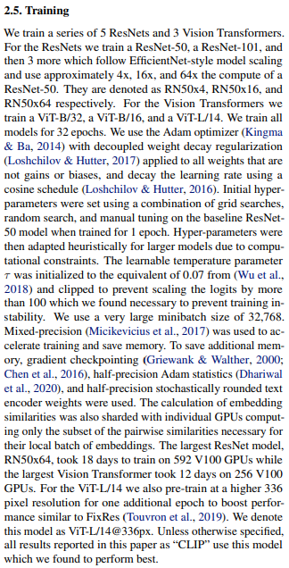

# train-CLIP 📎

A PyTorch Lightning solution to training CLIP from scratch.
 
## Usage 🚂

This training setup is easily usable right outside the box! Simply provide a training directory or your own dataset and we've got the rest covered. To train a model just specify a name from the paper name and tell us your training folder and batch size. All possible models can be seen in the yaml files in `models/config`

```
python train.py --model_name RN50 --folder data_dir --batchsize 512
```

### Training with our DataModule 📉

As long as each of the image pairs have the same stem name (i.e. `coco_img1.png` and `coco_img1.txt`) all that you need to do is specify the folder on runtime. Any subfolder structure will be ignored, meaning `foo/bar/image1.jpg` will always find its `myster/folder/image1.txt` so long as they share a common parent folder. All image suffixes will work, the only expectation is that captions are separated by `\n`.

### Traing with you own Data 📊

If you have different training needs you may drop in your very own DataLoader. Edit the `train.py` script to you needs by commenting out our DataModule and inserting your own into `trainer.fit(model, your_data)`. The only expectation is that the first item of the return tuple is the image batch, and the second is the text batch.

## Goal ⚽

Our aim is to create an easy to use Lightning implementation of OpenAI's clip training script. We want our end product to be as inline with the orignal paper as possible. We will live by:

<p align="center">
    
</p>


## TODO ✅

- [x] Get OpenAI's model creation script
- [x] Create model inits
  - [x] ResNet50
  - [x] ResNet50x4
  - [x] ResNet101
  - [x] ViT-B/32
  - [x] all models
- [x] Create model wrapper
- [x] Create lightning trainer
- [x] Create dataset files 
- [ ] Performance boosts
  - [x] Mixed-precision
  - [ ] Gradient checkpointing
  - [ ] Half-precision Adam statistics
  - [ ] Half-precision stochastically rounded text encoder weights
  - [ ] Self-distillation
